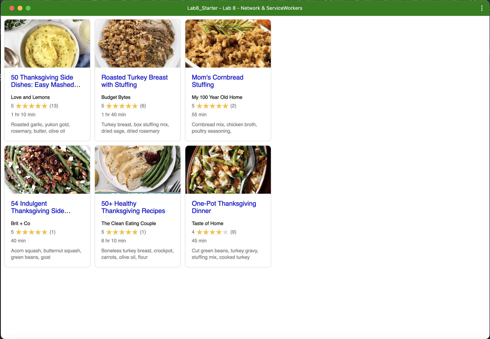

# Lab8-Starter
Cody Lee, Jonathan Cohen-Wang

[https://jcohenwang.github.io/Lab8_Starter/](https://jcohenwang.github.io/Lab8_Starter/)

Both are working with background functionality to make sure that the end result is fuunctional. It also seems as though they work in tandem so that when the normal processes that require the internet cannot access the internet, the service workers come along to help out where as if they are on internet, the normal code from graceful degredation is doing its job.

